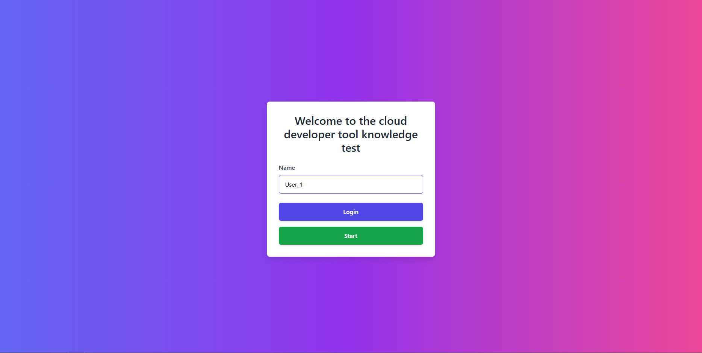
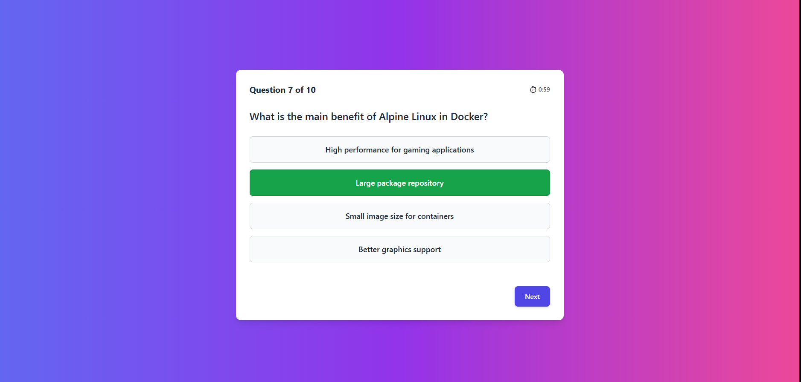
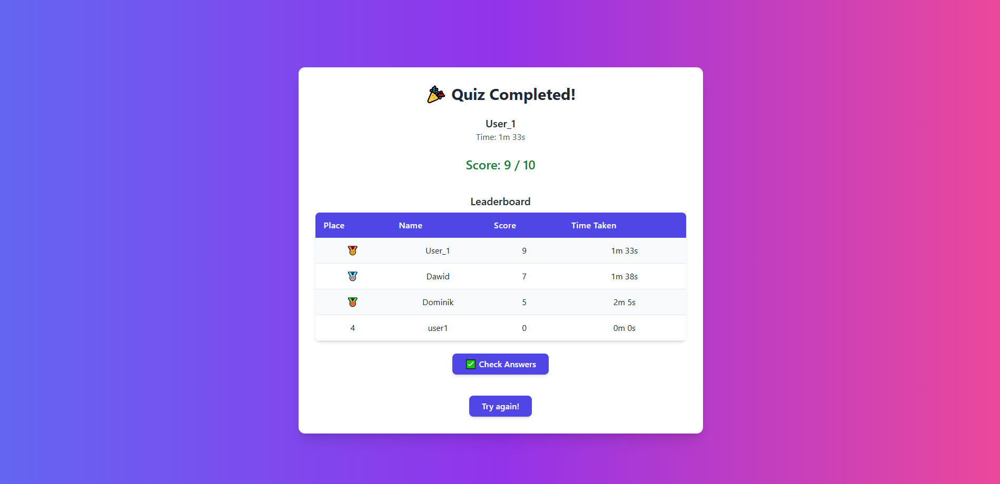
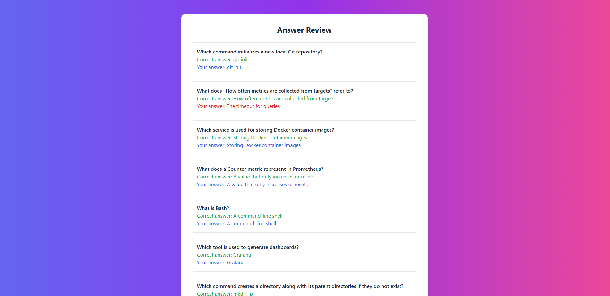

# 🧠 MyQuiz App

MyQuiz is a fullstack quiz application that allows users to solve quizzes, view their results, and interact with questions stored in a remote database. The project uses React (frontend) and ASP.NET Core Web API (backend), with the database hosted in Azure SQL Database. The application is automatically built and deployed using a GitHub Actions CI/CD pipeline.

## 🔧 Technologies

✅ Frontend: React + TypeScript  
✅ Backend: ASP.NET Core (.NET 8) + Entity Framework Core  
✅ Database: Azure SQL Database  
✅ Hosting: Azure Container Apps  
✅ CI/CD: GitHub Actions (build & deploy to ACR)

## 📌 Features

- Quiz system with questions and answers  
- Score tracking and result display  
- Cloud-based SQL backend on Azure  
- Automated deployment with GitHub Actions  

## ☁️ Cloud Deployment

This repository includes a GitHub Actions pipeline that:

- Builds a Docker image from the provided Dockerfile  
- Pushes the image to Azure Container Registry (ACR)  
- The container is then deployed to Azure Container Apps (manually due to permission limitations)

## 🗄️ Database

In the production environment, the application connects to Azure SQL Database.

## 🔐 Security

- Passwords are stored securely using hashing  
- API access is protected with JWT-based authorization  
- Environment variables and secrets are managed securely via GitHub Secrets and Azure

## 🖼️ Screenshots

### 🔐 Login Page

### 🧠 Quiz Interface

### 📊 Results View

### 📋 Answer Review Page
